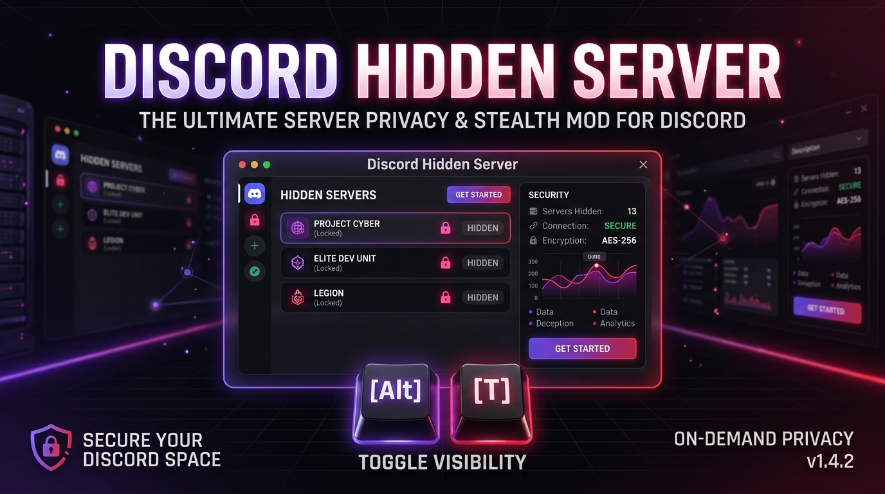

<p align="center">
  
</p>

# 🛡️ Discord Hidden Server (Vencord Plugin)

<p align="center">
  
  <br />
  <b>Developed with ❤️ by <a href="https://github.com/whiteexcellent">whiteexcellent</a></b>
</p>

---

A powerful, privacy-focused custom plugin for **Vencord** that allows you to hide multiple Discord servers behind password protection, custom hotkeys, auto-relock timers, and an emergency panic lock button.

---

## ✨ Key Features

- **🔒 Hide Multiple Servers**: Hide any number of Discord servers from your left sidebar seamlessly.
- **🔑 Password & Hotkey Protection**: Configure unique hotkeys (e.g. `Alt+T`, `Alt+G`) and PIN/passwords for each server.
- **🚨 Emergency Panic Lock (`Alt+Shift+L`)**: Instantly locks all hidden servers with a single keypress or button and safely redirects your view to Direct Messages (`@me`).
- **⏱️ Auto-Relock & Window Blur Protection**:
  - Automatically relocks servers after a configurable timer (5, 10, 30 mins).
  - Automatically locks all servers when Discord loses focus or minimizes.
- **🔕 Notification & Sound Suppression**: Suppresses desktop notifications and mention sounds for locked servers.
- **🎯 Visual Guild Picker**: Pick servers directly from your joined servers list with live search and custom avatars.
- **📁 Import / Export Backup (JSON)**: Export your plugin settings to a `.json` backup file and restore them anytime.
- **💎 Premium UI/UX**: Built with 3D Keycap badges (`[Alt] + [T]`), live dashboard metrics, pulsing status indicators, and glassmorphism card animations.

---

## 🚀 Installation & Usage

1. Copy the `hiddenServer` folder into your Vencord workspace under **`src/userplugins/hiddenServer`**:
   ```text
   Vencord/src/userplugins/hiddenServer/
   ├── index.tsx
   └── styles.css
   ```
2. Open a terminal in your Vencord directory and build the client:
   ```bash
   pnpm build
   ```
3. Press **`Ctrl + R`** inside Discord to reload the client.
4. Go to **Vencord Settings -> Plugins -> HiddenServer -> 🔒 Open Control Center** to manage your hidden servers.

---

## 👨‍💻 Author

<p align="left">
  
  <a href="https://github.com/whiteexcellent"><b>whiteexcellent</b></a>
</p>

---

## 📜 License

This project is licensed under the **GNU General Public License v3.0 (GPL-3.0)** - see the [LICENSE](./LICENSE) file for details.
